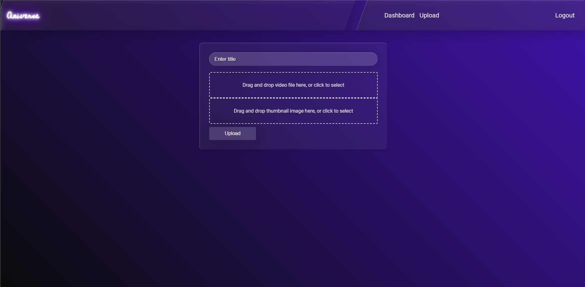

# Aniverse

Anivers is a robust and scalable anime streaming platform built leveraging various AWS services. This platform allows users to stream their favorite anime shows seamlessly, with a backend architecture designed to handle high traffic and ensure data security.


## Application Sneak Peek
- **Login - Sign up**
<div align="center">
    
    
</div>

- **OTP Verification**
<div align="center">
    
    
</div>

- **Main Page**
<div align="center">
    
    
</div>

- **Search**

<div align="center">
    
    
</div>

- **Video Player**

<div align="center">
    
    
</div>

- **Admin Panel**

<div align="center">
    
    
</div>


## Architecture Overview

<div align="center">
    
    
</div>

Anivers utilizes a combination of AWS services to deliver a high-performance, reliable, and secure streaming experience. The primary components and services involved in the architecture include:

1.  **Amazon S3**
    - Used for storing video files and other static assets.
    - Enables scalable storage with high availability and durability.
2. **Amazon DynamoDB**

    - A NoSQL database used for storing user data, metadata about the anime contents.
    - Provides fast and predictable performance with seamless scalability.
3. **Amazon CloudFront**

    - A content delivery network (CDN) used to distribute video content globally with low latency.
    - Ensures a smooth streaming experience by caching content at edge locations.
4. **Amazon EC2 (Elastic Compute Cloud)**

    - Hosts the application Frontend that run the core logic of the platform.

5. **AWS Backup**

    - Automates and centralizes data backup across AWS services.
    - Ensures data protection and compliance with backup policies.
6. **AWS Lambda**

    - Serverless computing service used for executing background tasks and processing events.
    - Handles tasks such as user authentication, video transcoding, and other asynchronous operations.
7. **Amazon Cognito**

    - Manages user authentication, authorization, and user management.
    - Provides secure sign-up and sign-in functionality along with user identity management.
8. **Amazon API Gateway**

    - Creates, publishes, maintains, monitors, and secures APIs at any scale.
    - Serves as the entry point for client requests, routing them to the appropriate backend services.

## Key Features

- **User Authentication and Management**

    - Secure user sign-up and sign-in using Amazon Cognito.
    - Multi-factor authentication (MFA) for enhanced security.
A   - uthentication using OTP (One-Time Password) verification for additional security.
- **Content Storage and Delivery**

    - Video files stored in Amazon S3 for scalable and durable storage.
    - Amazon CloudFront used to deliver content globally with low latency.
- **Scalable Backend**

    - Application logic hosted on Amazon EC2 instances to handle dynamic content.
    - AWS Lambda functions for processing background tasks and asynchronous operations.
- **Database and Caching**

    - Amazon DynamoDB used for fast and scalable data storage.
- **API Management**

    - Amazon API Gateway to expose RESTful APIs for frontend-backend communication.
    - Ensures secure and scalable API interactions.
- **Backup and Recovery**

    - AWS Backup for automated and centralized backup management.
    - Regular backups to protect against data loss and ensure recovery.
- **User Panels**

    - User Panel:
        - Allows users to browse, search, and stream anime content.
    - Admin Panel:
        - Allows administrators to upload videos to Amazon S3.

- **Searching Facility**

    - Robust search functionality to help users quickly find their favorite anime shows.
    - Search based on various criteria such as title, genre, and release date.

## Getting Started

To set up the Anivers platform locally or on your AWS account, follow these steps:

1. Clone the Repository:

```
git clone https://github.com/sneh2102/anivers.git
cd anivers
```
2. Configure AWS Credentials:
    - Ensure your AWS CLI is configured with the necessary credentials to access your AWS resources.

3. Add Backend Zips to S3:

    - Navigate to the Backend folder in the cloned repository.
    - Upload all the zip files to an S3 bucket.
    ```
      AddUserFunction:
    Type: AWS::Lambda::Function
    Properties:
      FunctionName: addUser
      Handler: index.handler
      Runtime: nodejs20.x
      Role: [Your_i_am_Role]
      Code:
        S3Bucket: [Bucket_Name]   \\Change to the bucket name that you have created
        S3Key: add_user.zip


4. Deploy the Infrastructure:

    - Upload the cloudformation.yaml file to AWS CloudFormation.
    - Follow the prompts in the AWS CloudFormation console to create the stack.

5. Completion:

    - Once CloudFormation has completed the stack creation, the Anivers platform is ready to use.